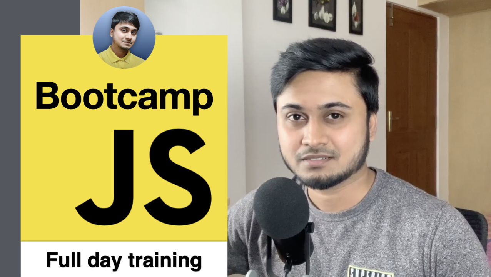

## Click [here](https://youtu.be/kmP4z1LJEKs) to watch the Bootcamp video.

In this 6.5 hours long Javascript Bootcamp, I will train you with the most important javascript concepts so that you can start building websites and prepare for your upcoming front-end interviews.

I will try to explain things in a simple but effective way to make you understand and remember these concepts.

The video has been tagged with chapters ( timestamps ) if you want to jump to different sections.

Subscribe to my [youtube channel](https://www.youtube.com/channel/UC1pwTpxZ3s1X_Vxb8K2uWYw) if you haven't already.

-MSK

## Note
1. Install [Better comments](https://marketplace.visualstudio.com/items?itemName=aaron-bond.better-comments) VS Code extension to view colored comments.
