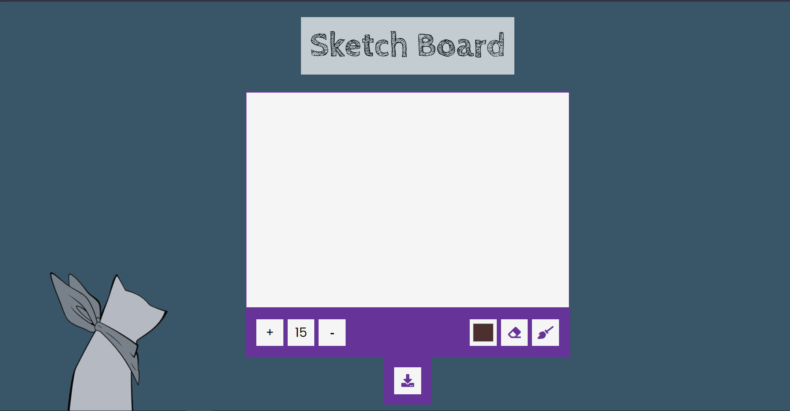
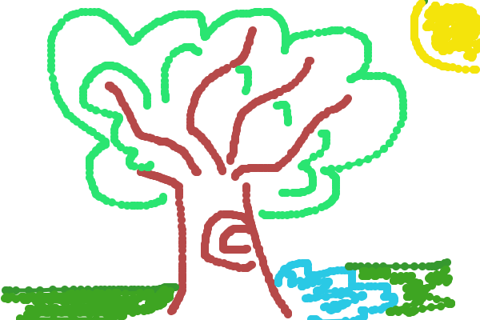

# Sketch_Board

## Description

A drawing board to create sketches developed using vanilla JavaScript.

## Functionalities
> Increase/Decrease the size of the brush.  
> Pick the color of the brush.  
> Can Erase strokes.  
> Can save the whole sketch in PNG format.

### Technologies used
- HTML  
- CSS  
- JavaScript  

# Front-end  
  

# Sketch Example  

Link to website: https://nitinshaily.github.io/Sketch_Board/  
<h3> 🤝🏻 &nbsp;Connect with Me </h3>

  

